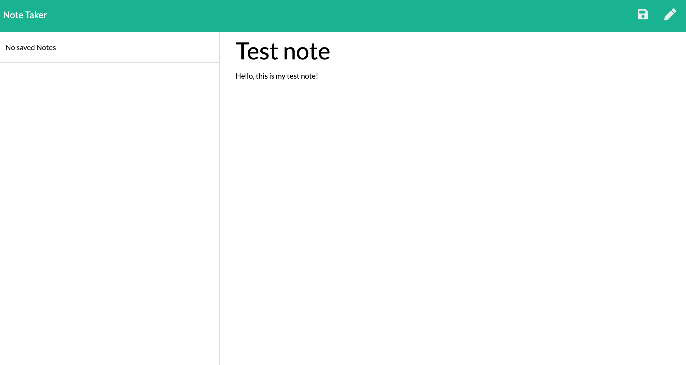
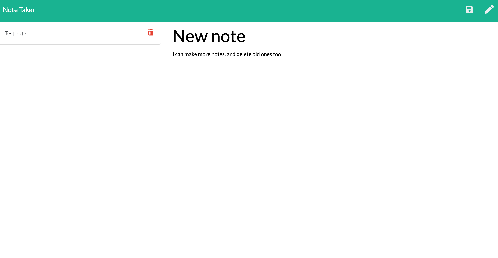

Author: Tomasz Siemion
Project: Take Notes
DEPLOY LINK: https://takesomenotes.herokuapp.com/notes

# TakeNotes
A simple note taking app with a file used as a database.

## Installation
The application uses NodeJS and the MySQL package.  To install run the following command:

```bash
npm i
```

## Usage
To run the application, you can use the CLI to launch the server on 'localhost' PORT 5000 or if you have an environment PORT set up.  To start the server, run the following command with the terminal targeting the location of server.js file.

```bash
node server.js
```

## Functionality
The application has a web browser based GUI which interacts with a server via CRUD server requests. The user can enter in a note, have it save to the 'database.'  The user can also and delete notes. 

## Images


